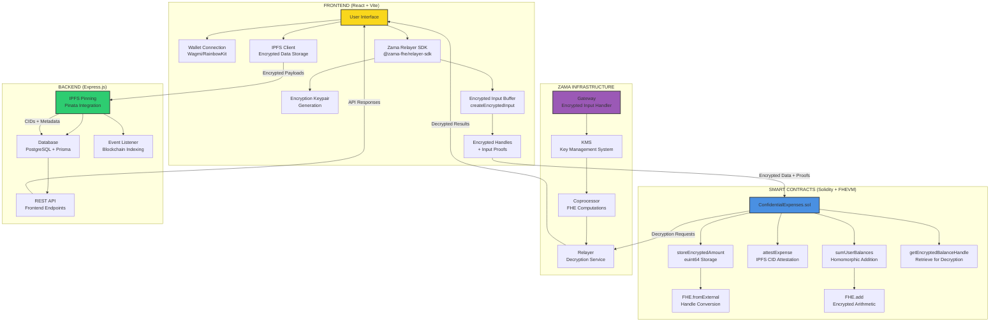
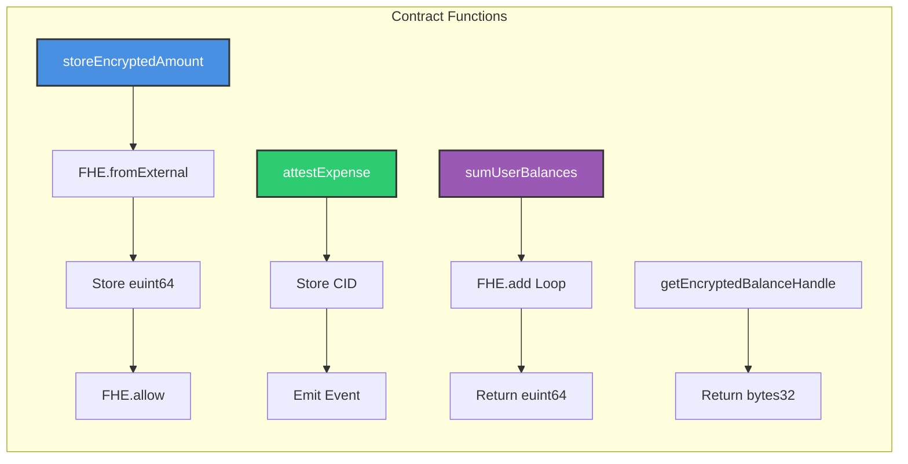
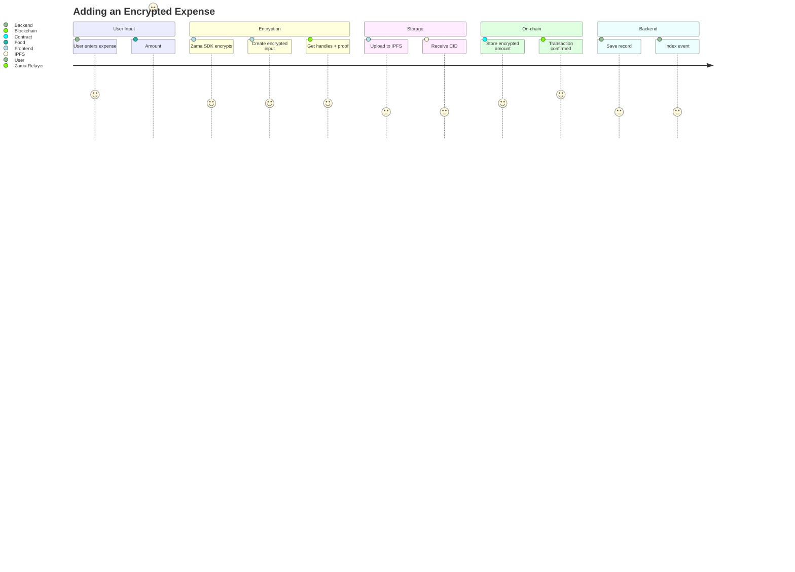
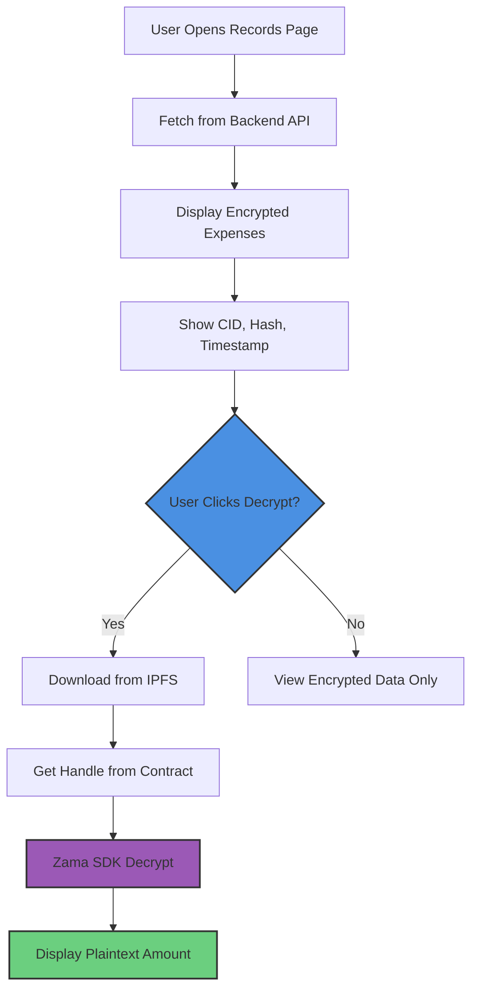
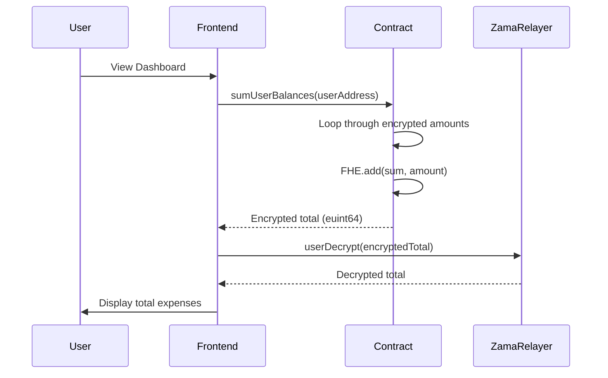
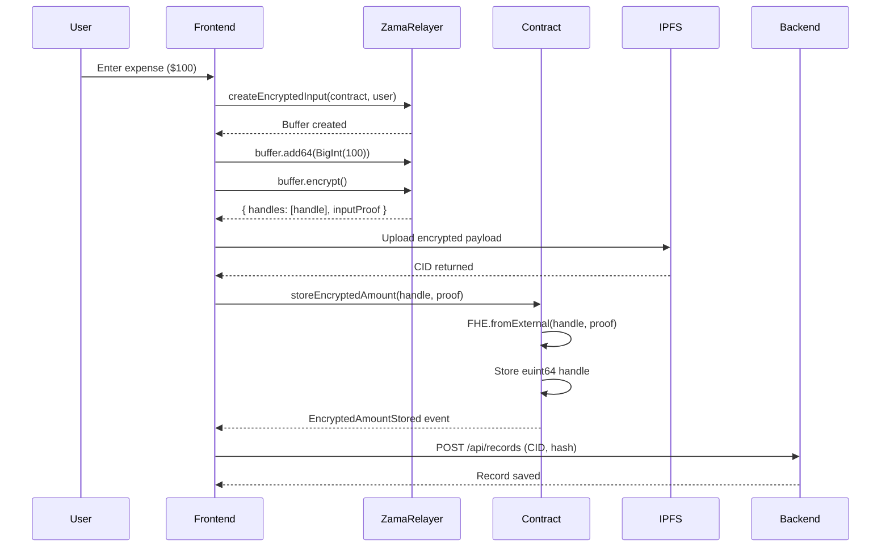
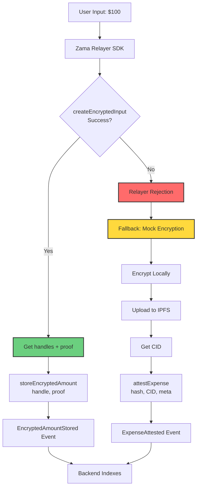
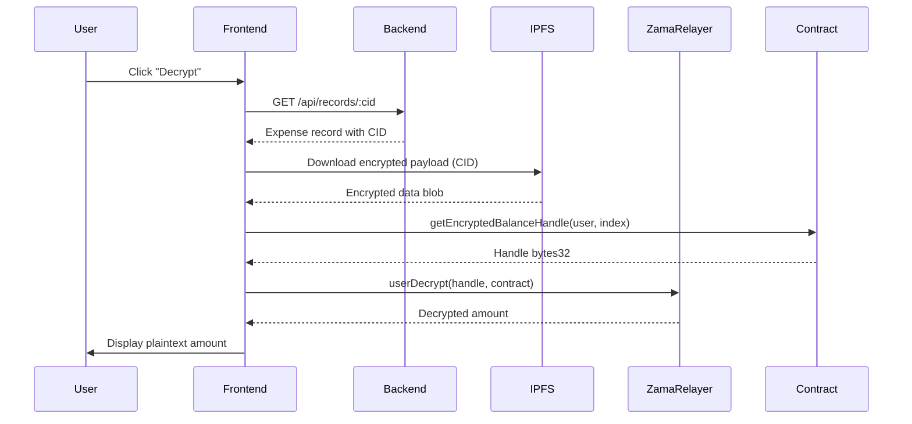
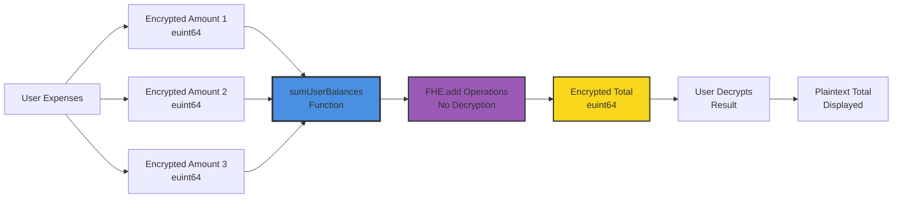
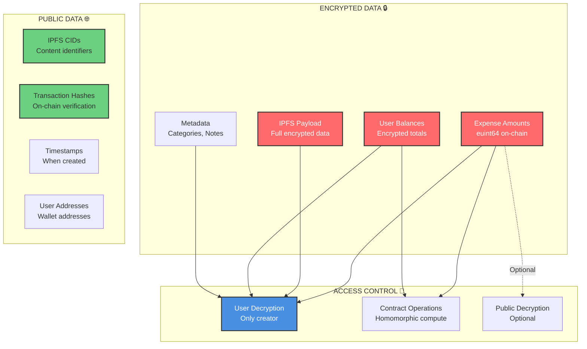

# Zama FHEVM Integration Documentation

## Overview

This Private Expense Tracker leverages Zama's FHEVM (Fully Homomorphic Encryption Virtual Machine) to provide complete privacy for user expense amounts, categories, and metadata while maintaining verifiable on-chain attestations. All sensitive financial data remains encrypted throughout the entire lifecycle - from encryption to storage to computation.

## Architecture

### System Architecture Diagram



### System Components

1. **Frontend (React + Vite)**
   - Wallet connection via Wagmi/RainbowKit
   - Zama Relayer SDK integration for FHE operations
   - IPFS upload/download for encrypted data storage
   - On-chain transaction submission

2. **Smart Contract (Solidity + FHEVM)**
   - `ConfidentialExpenses.sol` - Main contract with FHE support
   - Stores encrypted amounts as `euint64` handles
   - Provides attestation for IPFS CIDs
   - Supports homomorphic operations on encrypted data

3. **Backend (Express.js)**
   - IPFS pinning service (Pinata integration)
   - Database storage (PostgreSQL via Prisma)
   - Blockchain event listener
   - REST API for frontend

4. **Zama Infrastructure**
   - Gateway: Handles encrypted inputs from frontend
   - KMS: Manages FHE encryption keys
   - Coprocessor: Performs FHE computations
   - Relayer: Returns decrypted results via callbacks

## FHEVM Features Used

### Encrypted Data Types

| FHE Type | Usage | Location | Description |
|----------|-------|----------|-------------|
| `euint64` | User balances, expense amounts, totals | `ConfidentialExpenses.sol` | 64-bit encrypted integers for financial amounts |
| `euint32` | Counters, indices | `ConfidentialExpenses.sol` | 32-bit encrypted integers for metadata |
| `euint8` | Flags, small values | `ConfidentialExpenses.sol` | 8-bit encrypted integers for compact data |
| `ebool` | Validation results, conditional logic | `ConfidentialExpenses.sol` | Encrypted boolean values for privacy-preserving conditions |
| `externalEuint64` | Input from relayer | Frontend → Contract | External encrypted handles from Zama Relayer SDK |

### Core FHEVM Operations

#### 1. Encryption Operations

**Plaintext to Encrypted:**
```solidity
euint64 encrypted = FHE.asEuint64(0);  // Initialize encrypted zero
```

**Import External Encrypted Data:**
```solidity
euint64 amount = FHE.fromExternal(encryptedAmount, inputProof);
```

#### 2. Encrypted Arithmetic

**Addition:**
```solidity
euint64 totalPool = FHE.add(currentPool, newAmount);
```

**Subtraction:**
```solidity
euint64 newBalance = FHE.sub(currentBalance, betAmount);
```

**Conditional Selection:**
```solidity
euint64 result = FHE.select(condition, ifTrue, ifFalse);
```

#### 3. Encrypted Comparisons

**Greater Than or Equal:**
```solidity
ebool isValid = FHE.ge(balance, amount);
```

**Less Than or Equal:**
```solidity
ebool withinLimit = FHE.le(optionIndex, maxOptions);
```

**Equality Check:**
```solidity
ebool isMatch = FHE.eq(userChoice, winningOption);
```

**Logical AND:**
```solidity
ebool allValid = FHE.and(condition1, condition2);
```

### 1. Encrypted Amount Storage (`euint64`)

**Purpose**: Store expense amounts in encrypted form on-chain

**Implementation**:
```solidity
mapping(address => euint64[]) private fheUserBalances;

function storeEncryptedAmount(externalEuint64 extHandle, bytes calldata attestation) public {
    euint64 handle = FHE.fromExternal(extHandle, attestation);
    fheUserBalances[msg.sender].push(handle);
    FHE.allow(handle, address(this));
    FHE.allow(handle, msg.sender);
    emit EncryptedAmountStored(msg.sender, FHE.toBytes32(handle));
}
```

**Frontend Flow**:
1. User enters expense amount
2. Frontend calls `createEncryptedInput(contractAddress, userAddress)`
3. Adds amount with `buffer.add64(BigInt(amount))`
4. Calls `buffer.encrypt()` to get `{ handles, inputProof }`
5. Calls `storeEncryptedAmount(handle, inputProof)` on contract
6. Contract verifies attestation and stores encrypted handle

### 2. Homomorphic Addition

**Purpose**: Compute encrypted totals without decryption

**Implementation**:
```solidity
function sumUserBalances(address user) public returns (euint64) {
    euint64 sum = FHE.asEuint64(0);
    FHE.allow(sum, address(this));
    
    for (uint i = 0; i < fheUserBalances[user].length; i++) {
        euint64 h = fheUserBalances[user][i];
        FHE.allow(h, address(this));
        sum = FHE.add(sum, h);
        FHE.allow(sum, address(this));
    }
    
    FHE.allow(sum, user);
    return sum;
}
```

**Use Case**: Calculate total expenses for a user without revealing individual amounts

### 3. Access Control (FHE.allow)

**Purpose**: Control who can decrypt or operate on encrypted data

**Patterns Used**:
- `FHE.allow(handle, address(this))` - Contract can operate on handle
- `FHE.allow(handle, msg.sender)` - User can decrypt their own data
- `FHE.makePubliclyDecryptable(handle)` - Optional public decryption

### 4. External Handle Conversion

**Purpose**: Convert off-chain encrypted inputs to on-chain handles

**Flow**:
1. Frontend creates encrypted input via Zama Relayer SDK
2. Relayer returns `externalEuint64` handle + attestation proof
3. Contract calls `FHE.fromExternal(extHandle, attestation)`
4. Returns `euint64` handle for on-chain operations

## Contract-by-Contract Breakdown

### ConfidentialExpenses.sol



**Main Functions**:

1. **`storeEncryptedAmount(externalEuint64, bytes)`**
   - Receives encrypted amount from frontend
   - Verifies relayer attestation
   - Stores as `euint64` handle
   - Sets up access permissions

2. **`attestExpense(bytes32, string, bytes)`**
   - Fallback function for IPFS CID attestation
   - Stores CID for verification
   - Emits event for off-chain indexing

3. **`sumUserBalances(address)`**
   - Homomorphic addition of all user expenses
   - Returns encrypted sum
   - User can decrypt result

4. **`getEncryptedBalanceHandle(address, uint256)`**
   - Retrieves handle bytes32 for decryption
   - Used by frontend for `userDecrypt()` calls

## Frontend Integration Flow

### Encryption Workflow

```typescript
// 1. Initialize Zama SDK
const instance = await getZamaInstance();

// 2. Create encrypted input buffer
const buffer = instance.createEncryptedInput(contractAddress, userAddress);

// 3. Add expense amount
buffer.add64(BigInt(Math.floor(amount)));

// 4. Encrypt and get handle + proof
const { handles, inputProof } = await buffer.encrypt();

// 5. Store handle and proof for contract call
const fheHandle = handles[0];
const attestation = inputProof;
```

### Contract Interaction

```typescript
// Option 1: Store encrypted amount (FHE)
if (usesFHE && fheHandle && inputProof) {
    writeContract({
        address: CONTRACT_ADDRESS,
        abi: CONTRACT_ABI,
        functionName: 'storeEncryptedAmount',
        args: [handleBytes, attestationBytes],
    });
}

// Option 2: Attest IPFS CID (fallback)
else {
    writeContract({
        address: CONTRACT_ADDRESS,
        abi: CONTRACT_ABI,
        functionName: 'attestExpense',
        args: [submissionHash, cid, txMeta],
    });
}
```

### Decryption Workflow

```typescript
// 1. Get handle from contract
const handleBytes32 = await contract.getEncryptedBalanceHandle(userAddress, index);

// 2. Decrypt using Zama SDK
const decrypted = await instance.userDecrypt(handleBytes32);

// 3. Display to user
console.log('Decrypted amount:', decrypted);
```

## Complete User Journeys

### Journey 1: Adding an Encrypted Expense



**Detailed Steps:**
1. **User Action**: Enters expense amount ($100), category, note
2. **Encryption**: Frontend encrypts amount using Zama Relayer SDK
3. **Storage**: Encrypted data uploaded to IPFS → receives CID
4. **On-chain**: 
   - If FHE succeeds: Calls `storeEncryptedAmount(handle, proof)`
   - If FHE fails: Calls `attestExpense(hash, cid, meta)` (fallback)
5. **Verification**: Transaction confirmed, event emitted
6. **Database**: Backend saves record with CID and transaction hash

### Journey 2: Viewing Encrypted Expenses



**Detailed Steps:**
1. **User Action**: Opens Records page
2. **Fetch**: Frontend fetches records from backend API
3. **Display**: Shows encrypted expenses with CID, hash, timestamp
4. **Decryption**: User clicks "Decrypt" → downloads from IPFS → decrypts locally
5. **Result**: Plaintext amount displayed only to user

### Journey 3: Computing Encrypted Totals



**Detailed Steps:**
1. **User Action**: Views dashboard
2. **Contract Call**: Frontend calls `sumUserBalances(userAddress)`
3. **Homomorphic Operation**: Contract adds all encrypted amounts
4. **Result**: Returns encrypted sum
5. **Decryption**: User decrypts sum to see total expenses

## Encryption Flow Diagrams

### Standard Encryption Flow



### Fallback Flow (Mock Encryption)



### Decryption Flow



### Homomorphic Aggregation Flow



## Privacy Architecture

### Data Privacy Matrix



### What is Encrypted

- ✅ **Expense Amounts**: Encrypted as `euint64` on-chain
- ✅ **IPFS Data**: Full encrypted payload (amount + metadata)
- ✅ **User Balances**: Encrypted totals for privacy

### What is Public

- ✅ **IPFS CIDs**: Public identifiers (content is encrypted)
- ✅ **Transaction Hashes**: On-chain verification
- ✅ **Timestamps**: When expenses were created
- ✅ **Categories**: Optional (can be encrypted if needed)

### Access Control

- **User Decryption**: Only the expense creator can decrypt their own amounts
- **Contract Operations**: Contract can perform homomorphic operations
- **Public Decryption**: Optional via `makePubliclyDecryptable()`

## Relayer Integration

### Zama Relayer SDK

**Configuration**:
- Relayer URL: `https://relayer.testnet.zama.org`
- Network: Sepolia (Chain ID: 11155111)
- Gateway Chain ID: 55815

**Key Methods**:
- `createEncryptedInput(contract, user)` - Create input buffer
- `buffer.add64(value)` - Add encrypted value
- `buffer.encrypt()` - Encrypt and get handle + proof
- `userDecrypt(handle)` - Decrypt user's data
- `publicDecrypt(handle)` - Decrypt publicly accessible data

### Relayer Callbacks

When `createEncryptedInput` succeeds:
- Relayer validates contract whitelist
- Generates encrypted handle
- Creates attestation proof
- Returns `{ handles, inputProof }`

When relayer rejects:
- Frontend falls back to mock encryption
- Uses `attestExpense` for on-chain verification
- Still maintains privacy via IPFS encryption

## Testing & Validation

### Unit Tests

```typescript
// Test encryption
const encrypted = await encryptExpenseWithFHE({
    amount: 100,
    currency: 'USD',
    category: 'food',
    timestamp: Date.now()
});

// Verify structure
expect(encrypted.ciphertextBlob).toBeDefined();
expect(encrypted.ciphertextPreviewHash).toBeDefined();
```

### Integration Tests

1. Deploy contract to Sepolia
2. Connect wallet
3. Create encrypted expense
4. Verify on-chain event
5. Decrypt and verify amount

### Manual Testing

1. **Encryption Test**: Create expense → verify IPFS upload → check CID
2. **Decryption Test**: Click decrypt → verify plaintext matches input
3. **On-chain Test**: Verify transaction on Etherscan → check event logs

## Troubleshooting

### Common Issues

1. **Relayer Rejection**
   - **Cause**: Contract not whitelisted
   - **Solution**: App falls back to mock encryption automatically

2. **Decryption Fails**
   - **Cause**: Handle not found or wrong permissions
   - **Solution**: Check `FHE.allow()` calls in contract

3. **IPFS Upload Fails**
   - **Cause**: Pinata API keys invalid
   - **Solution**: Verify environment variables

## Future Enhancements

- [ ] Encrypt categories and notes with FHE
- [ ] Add homomorphic comparison operations
- [ ] Implement encrypted expense filtering
- [ ] Add multi-user encrypted sharing
- [ ] Support encrypted expense reports

## References

- [Zama FHEVM Documentation](https://docs.zama.org/protocol)
- [Zama Relayer SDK Guide](https://docs.zama.org/protocol/relayer-sdk-guides)
- [FHEVM Solidity Guide](https://docs.zama.org/protocol/solidity-guides)
- [Contract Source Code](../hardhat/contracts/ConfidentialExpenses.sol)

